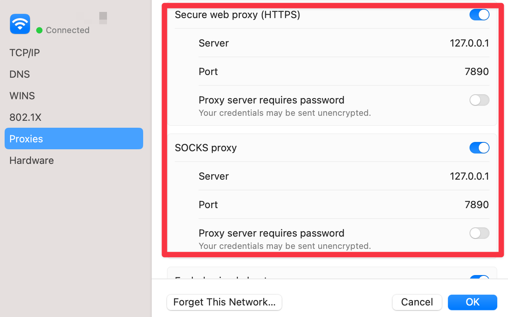

# mac_proxy

[](https://crates.io/crates/mac_proxy)

This is a crate for Rust to fetch the proxy settings 
on MacOS.



# Install

```shell
cargo add mac_procy
```

# Usage

```rust
let settings = mac_procy::mac_proxy_settings()
```

# Result

```json
{
  "ExceptionsList": [
    "192.168.0.0/16",
    "10.0.0.0/8",
    "172.16.0.0/12",
    "127.0.0.1",
    "localhost",
    "*.local",
    "timestamp.apple.com",
    "sequoia.apple.com",
    "seed-sequoia.siri.apple.com"
  ],
  "ExcludeSimpleHostnames": 0,
  "HTTPEnable": 1,
  "HTTPPort": 7890,
  "HTTPProxy": "127.0.0.1",
  "HTTPSEnable": 1,
  "HTTPSPort": 7890,
  "HTTPSProxy": "127.0.0.1",
  "ProxyAutoConfigEnable": 0,
  "SOCKSEnable": 1,
  "SOCKSPort": 7890,
  "SOCKSProxy": "127.0.0.1",
  "__SCOPED__": {
    "en0": {
      "ExceptionsList": [
        "192.168.0.0/16",
        "10.0.0.0/8",
        "172.16.0.0/12",
        "127.0.0.1",
        "localhost",
        "*.local",
        "timestamp.apple.com",
        "sequoia.apple.com",
        "seed-sequoia.siri.apple.com"
      ],
      "ExcludeSimpleHostnames": 0,
      "HTTPEnable": 1,
      "HTTPPort": 7890,
      "HTTPProxy": "127.0.0.1",
      "HTTPSEnable": 1,
      "HTTPSPort": 7890,
      "HTTPSProxy": "127.0.0.1",
      "ProxyAutoConfigEnable": 0,
      "SOCKSEnable": 1,
      "SOCKSPort": 7890,
      "SOCKSProxy": "127.0.0.1"
    },
    "en1": {
      "ExceptionsList": [
        "192.168.0.0/16",
        "10.0.0.0/8",
        "172.16.0.0/12",
        "127.0.0.1",
        "localhost",
        "*.local",
        "timestamp.apple.com",
        "sequoia.apple.com",
        "seed-sequoia.siri.apple.com"
      ],
      "ExcludeSimpleHostnames": 0,
      "HTTPEnable": 1,
      "HTTPPort": 7890,
      "HTTPProxy": "127.0.0.1",
      "HTTPSEnable": 1,
      "HTTPSPort": 7890,
      "HTTPSProxy": "127.0.0.1",
      "ProxyAutoConfigEnable": 0,
      "SOCKSEnable": 1,
      "SOCKSPort": 7890,
      "SOCKSProxy": "127.0.0.1"
    }
  }
}
```